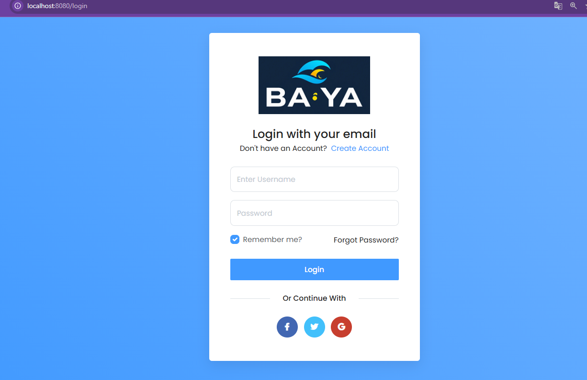
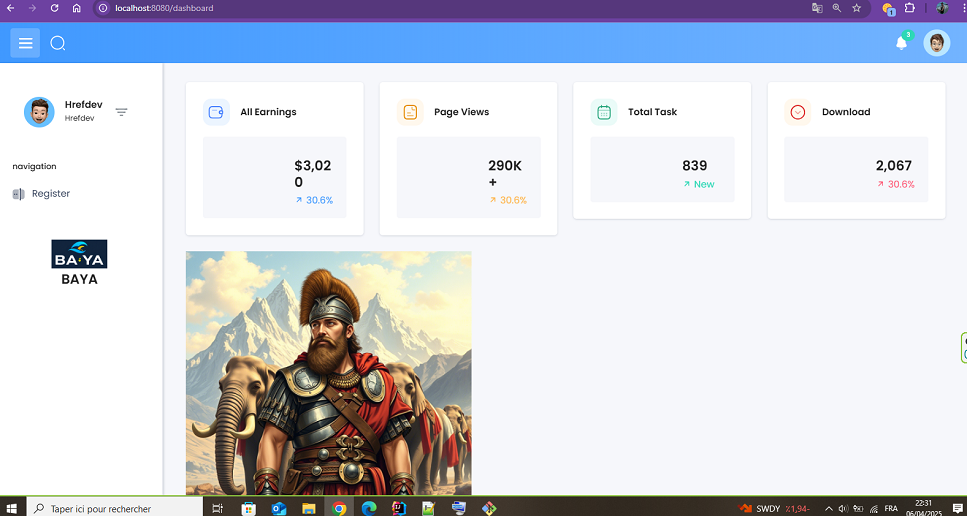

# 📊 Spring Boot Admin Dashboard App

A full-featured Java web application built with **Spring Boot**, **Spring Security**, **Hibernate**, and **MySQL**. Features include user registration with email verification, role-based access control, and a responsive admin dashboard.

---

## 🚀 Features

- ✅ User Registration
- 📧 Email Verification (Token-based)
- 🔐 Login & Logout with Spring Security
- 🛡️ Role-based Access Control (Admin, User)
- 🧑 Admin Dashboard (Manage Users & Roles)
- 📚 Hibernate + JPA Integration
- 🗄️ MySQL as persistent database
- 🖥️ Thymeleaf UI (or RESTful API if headless)

---

## 🛠️ Tech Stack

| Layer | Tech |
|-------|------|
| Backend | Java, Spring Boot, Spring Security |
| Database | MySQL, JPA (Hibernate) |
| View (optional) | Thymeleaf (or replace with React/Vue) |
| Email | JavaMailSender |
| Build Tool | Maven / Gradle |

---

